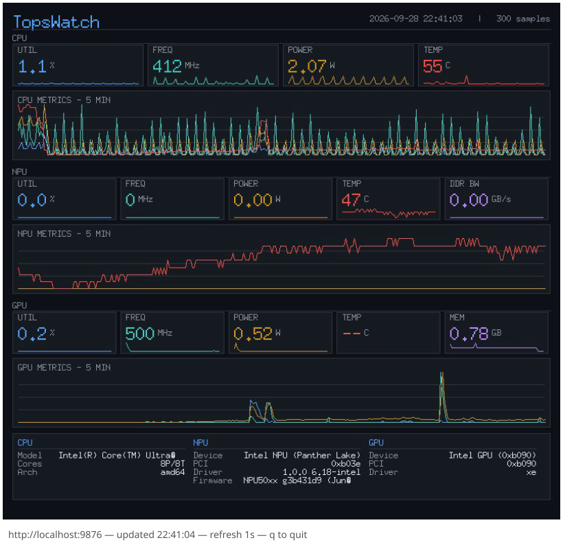
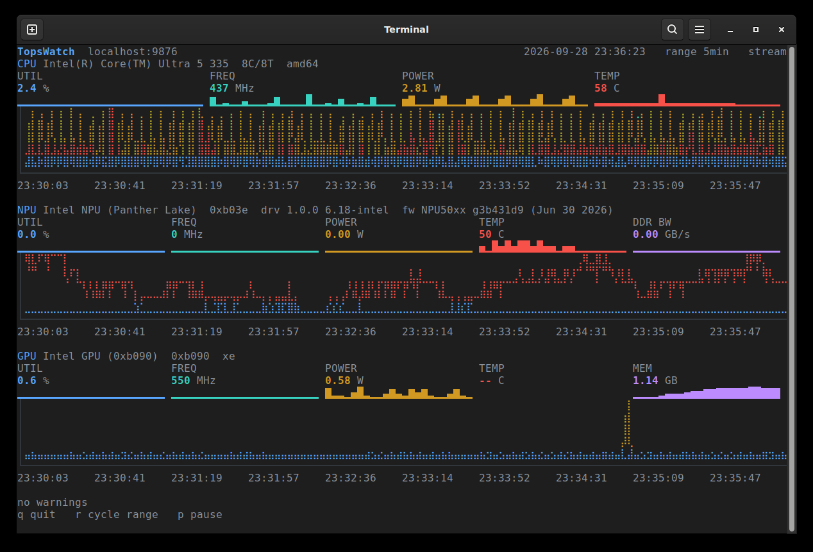
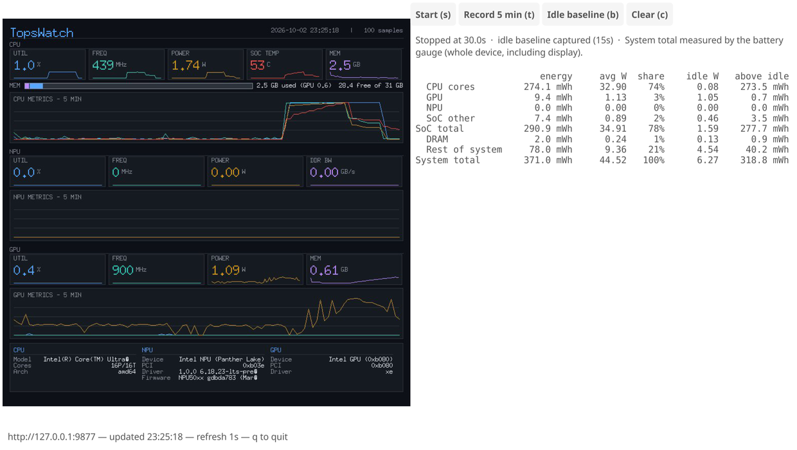

# TopsWatch

Hardware telemetry monitor for Edge AI devices. Specifically designed to
work with the Intel Core Ultra Series 3 Panther Lake CPUs, including
retrieving metrics from the NPU and GPU. May also work with earlier
hardware generations such as Meteor Lake, Lunar Lake, and Arrow Lake, but
these have not been tested. Linux only. Single Go binary,
no external runtime dependencies. Reads CPU, GPU, and NPU metrics directly
from sysfs, hwmon, Intel PMT, RAPL, and `perf_event_open`.

The monitor exports a web UI that may be consumed directly, and it also
exports a Prometheus endpoint that may be used with the typical Prometheus
and Grafana monitoring stack. For lighter-weight viewing there is a
terminal dashboard (`--tui`, works over SSH) and a small desktop viewer
(`topswatch-gui`); both attach to a running daemon, locally or remotely.
See [Viewers](#viewers).



*The desktop viewer on a Core Ultra 5 335. The web UI shows the same
cards and charts plus per-core, per-engine and process detail; the
terminal viewer shows them in text (see [Viewers](#viewers)).*

Despite the name, TopsWatch doesn't actually monitor TOPS. It monitors
the behavior of hardware. AI thought TopsWatch would be a catchy name,
and I agreed!

Disclaimer: This application is intended for experimental and educational
use only. No warranty expressed or implied. This application is not
represented as a benchmark and is not intended to make any performance
claim.

## Metrics

### CPU

| Metric | Unit | Source |
|--------|------|--------|
| Utilization | % | `/proc/stat` (delta) |
| Cores Used | cores | `/proc/stat` (Irix-style) |
| Frequency | MHz | `cpufreq/scaling_cur_freq` (mean) |
| Power | W | RAPL `package` energy_uj (delta) |
| Temperature | °C | hwmon `coretemp`/`k10temp` |
| Per-core utilization | % | `/proc/stat` per-cpu lines |
| Per-core frequency | MHz | per-cpu `scaling_cur_freq` |
| System memory used / total | bytes | `/proc/meminfo` (`MemTotal - MemAvailable`) |

Per-core metrics carry `core` and `core_type` (`performance`/`efficient`/`low_power`) labels.

### GPU

| Metric | Unit | Source |
|--------|------|--------|
| Utilization | % | `perf_event_open` engine-active/total ticks (xe) or busy-ns (i915) |
| Per-engine busy | % | Same, per engine label |
| Frequency (actual/requested/min/max/rp0/rpe/rpn) | MHz | Xe sysfs `tile*/gt*/freq0/` or i915 `gt_*_freq_mhz` |
| Temperature | °C | hwmon `temp*_input` (when xe_hwmon present) |
| Power | W | RAPL `uncore` energy_uj (delta); falls back to the GT energy counter in Intel PMT where the kernel registers no uncore zone (a boot-time race in the RAPL driver; `modprobe -r intel_rapl_msr && modprobe intel_rapl_msr` restores the zone) |

Supports both the Xe driver (Panther Lake, Lunar Lake) and i915 driver
(older platforms) automatically.

### NPU

| Metric | Unit | Source |
|--------|------|--------|
| Utilization | % | sysfs `npu_busy_time_us` (delta) |
| Frequency | MHz | PMT `VPU_WORKPOINT` register |
| Power | W | PMT `VPU_ENERGY` register (delta, U18.14 fixed-point) |
| Temperature | °C | PMT `SOC_TEMPERATURES` register |
| DDR Bandwidth | MB/s | PMT `VPU_MEMORY_BW` register (delta; 1000-byte counts on MTL/ARL, 1024-byte on LNL/PTL) |
| Tile Config | count | PMT `VPU_WORKPOINT` register |
| Memory Used | bytes | sysfs `npu_memory_utilization` (PTL+) |

### Power and energy

| Metric | Unit | Source |
|--------|------|--------|
| Energy per RAPL domain (`package`, `core`, `uncore`, `dram`, `psys`) | J, cumulative | RAPL `energy_uj` for every zone the platform exposes |
| Power per RAPL domain | W | same counters (delta) |
| NPU energy | J, cumulative | PMT `VPU_ENERGY` register |
| System power and energy | W / J | battery fuel gauge (`power_supply`), **only while discharging** |
| Battery capacity, voltage, state | %, V | `power_supply` |

This collector adapts to the hardware: a desktop with no battery, a
board with no `psys` or no `uncore` domain, or a machine that hides RAPL
simply reports fewer domains. Nothing is an error. See
[Measuring energy](#measuring-energy-watt-hours).

See [METRICS.md](METRICS.md) for full details on sources, computation,
and Prometheus metric names.

## Usage

```bash
# Build
make build

# One-shot text output
./topswatch --text

# Start web server + Prometheus (default)
./topswatch

# Custom config
./topswatch --config /path/to/topswatch.yaml

# Override port
./topswatch --port 8080
```


## Viewers

TopsWatch has four ways to look at the data. The daemon collects once;
every viewer attaches to it.

| Viewer | Where it runs | Needs | Best for |
|---|---|---|---|
| Web UI (`/`) | any browser | nothing extra | full dashboard: per-core, per-engine, processes, warnings |
| Terminal `--tui` | any terminal, incl. SSH | the `topswatch` binary | remote shells, headless devices, low overhead |
| Desktop `topswatch-gui` | Ubuntu Desktop (X11/Wayland) | separately built binary | a small always-on window on the device itself |
| `--text` | any terminal | the `topswatch` binary | one-shot readout, scripts |

The TUI and GUI are **clients**: they read the daemon's HTTP API and never
touch hardware, so they need no root, no config file, and no special
permissions. They default to `localhost:9876` and take `--connect` for
another host.

### Viewer overhead

Measured on a Core Ultra 5 335 (Panther Lake) running Ubuntu 24.04 with
the daemon at its default 1s interval. Numbers are the **extra** CPU each
viewer adds to the machine, as a percentage of one core, including what
it costs the daemon and the display stack. The daemon alone uses about
2.8%.

| Viewer | Added CPU | Notes |
|---|---|---|
| Terminal `--tui` over SSH | ~2% | 1.3% streaming, 0.9% with `--refresh 5s` |
| Terminal `--tui` in a desktop terminal window | ~2.5% | terminal emulator and compositor add under 1% |
| Desktop `topswatch-gui` | ~4.5% at 1s, ~2.5% at 5s | the difference is the daemon rendering a JPEG per fetch |
| Web UI in Firefox | ~40% | browser 18%, Xorg 14%, compositor 5% |

Full tables, method and caveats are in [VIEWERS.md](VIEWERS.md).

### Terminal viewer (`--tui`)



Built into the daemon binary. Start a daemon first (as root, since RAPL,
PMT and perf need it), then attach from any terminal:

```bash
sudo ./topswatch                 # daemon, in one shell or as a service
./topswatch --tui                # viewer, in another shell or over SSH
```

Flags:

| Flag | Default | Meaning |
|---|---|---|
| `--connect ADDR` | `localhost:9876` | daemon to attach to: `host`, `host:port`, `[v6addr]:port`, or `http://…` |
| `--refresh N` | `0` (stream) | `0` follows the daemon's SSE stream and redraws once per sample; `N` (e.g. `5s`) polls instead, for a slower, cheaper display |
| `--energy` | off | add the watt-hour panel and its keys (s/b/c); see [Measuring energy](#measuring-energy-watt-hours) |

Keys: `q` quit · `r` cycle history range (5min / 1h / 24h) · `p` pause.

The layout adapts to the terminal: 40 rows or more shows cards, sparklines
and a braille chart per module; below about 20 rows the charts are
dropped and only the cards remain. Colours need a 256-colour terminal
(`TERM=xterm-256color` is typical).

Examples:

```bash
# Over SSH, on the device
ssh user@device ./topswatch --tui

# From your laptop, against a remote daemon (the binary runs anywhere Go does)
./topswatch --tui --connect device.local

# IPv6 literal and a slower poll
./topswatch --tui --connect '[fe80::1%eth0]:9876' --refresh 5s
```

If the daemon is not reachable the TUI shows the error in its footer and
keeps retrying; it fills in as soon as the daemon answers.

### Desktop viewer (`topswatch-gui`)

A small window that shows the daemon's own rendered dashboard
(`/snapshot.jpg`) and refreshes it on a timer. It has no rendering logic
of its own, so it always matches the web snapshot. It is a separate
binary built with a build tag, because the Fyne toolkit needs cgo and
OpenGL/X11 headers; the daemon binary stays static and dependency-free.

```bash
# Build once, on a machine with a desktop toolchain (Ubuntu/Debian)
sudo apt install gcc libgl1-mesa-dev xorg-dev libxkbcommon-dev libwayland-dev
make gui                                  # produces ./topswatch-gui

# Run
./topswatch-gui                           # local daemon, 1s refresh
./topswatch-gui --connect device.local --refresh 2s
```

The default build supports both X11 and Wayland sessions, which is why
it needs the Wayland headers even on an X11 desktop. If you would rather
not install those, build the X11-only variant:

```bash
sudo apt install gcc libgl1-mesa-dev xorg-dev
make gui GUI_TAGS="gui x11"
```

Flags are `--connect` (as above) and `--refresh` (default `1s`). `q` or
`Escape` closes the window. The status bar shows the daemon address, the
time of the last update, and any connection error.

### Using the viewers with the Docker deployment

The container image contains only the `topswatch` binary (no shell, no
GUI). There are two ways to use the TUI with it.

**Run the TUI inside the running container.** Give the container a name
when you start it, then `exec` the same binary in viewer mode. It attaches
to the daemon over the container's own loopback:

```bash
docker run -d --name topswatch --privileged --pid=host \
  -v /sys:/sys:rw -v /proc:/proc:ro -p 9876:9876 topswatch

docker exec -it -e TERM=xterm-256color topswatch /topswatch --tui
```

`-it` gives the TUI a terminal and `-e TERM` gives it colours; `-e
COLUMNS`/`-e LINES` are not needed, the size is taken from your terminal.

**Run a viewer on the host (or anywhere) against the published port.**
Build or download the `topswatch` binary on the host and point it at the
port you published with `-p`:

```bash
./topswatch --tui --connect localhost:9876
./topswatch-gui --connect localhost:9876
```

This is the only way to use the desktop viewer with Docker, since the
image cannot open a window. With `--net-host` (as in the `ctr` example
below) the daemon is on the host's `9876` directly and the same commands
apply.

### Using the viewers with the Helm chart

The DaemonSet exposes the daemon on every node at the NodePort (default
`30987`), so from any machine that can reach a node:

```bash
./topswatch --tui --connect node-1.example:30987
./topswatch-gui --connect node-1.example:30987
```

Or forward a pod's port and use a viewer on your own machine:

```bash
kubectl port-forward ds/topswatch 9876:9876
./topswatch --tui            # or ./topswatch-gui
```

You can also `kubectl exec -it <pod> -- /topswatch --tui` to run the TUI
inside a pod. `kubectl exec` does not pass your `TERM` through and the
distroless image has no way to set it, so expect a monochrome display
that way; `port-forward` gives the full-colour one.

## Measuring energy (watt-hours)

The daemon keeps cumulative energy counters, so any client can bracket a
test, benchmark or demo and report how much energy it used, broken down
by component.



*A 30-second, 16-thread CPU load on a Dell XPS 14 on battery, after a
16-second idle baseline. The system total is measured by the battery
gauge: 371.0 mWh in all, of which the demo itself cost 318.8 mWh on top
of the 52 mWh the laptop would have used anyway at its 6.3 W steady
state.*

### How the counters work

- **The daemon is an odometer.** Every energy source it reads is a
  cumulative counter: RAPL's `energy_uj` files for the SoC package,
  CPU cores, GPU, DRAM and (where present) the platform, Intel PMT's
  energy registers for the NPU and, on kernels that hide the GPU's RAPL
  zone, the GPU, and the battery's current and voltage integrated over
  time. The daemon turns each into joules accumulated since it started
  and exports that number on every sample. It never resets while
  running.
- **A measurement is two readings and a subtraction.** Start and stop
  are just samples; nothing has to be armed. Divide joules by 3600 for
  watt-hours and by elapsed seconds for average watts. Because the
  underlying counters are cumulative there is no sampling error from
  the poll interval, and a slower interval loses nothing.
- **The rows add up without double counting.** RAPL domains nest: the
  package already contains the cores, the GPU and the NPU, and the
  system contains everything. The report shows components plus the
  remainders ("SoC other" is the package minus cores, GPU and NPU;
  "Rest of system" is the system minus the SoC and DRAM) so the rows
  sum to the totals.
- **"Above idle" is the demo's own cost.** An idle baseline records
  average watts per row while the device sits in the state the demo
  will run in. For a later run, steady state is idle watts times the
  run's seconds and the demo itself is the total minus that.
- **Battery readings are only trusted while the battery is powering
  the device.** On external power a gauge shows charging, or nothing.
  The daemon counts battery energy only while discharging, checks that
  the battery is supplying at least what the SoC alone draws (a full
  battery on a device fed through an unreported port can claim
  "Discharging" while supplying nothing), and records how many seconds
  it actually covered. A client accepts the battery total only when
  that coverage matches the window; otherwise it falls back to `psys`
  or reports no system total, and says why.
- **Bad ticks are dropped, not folded in.** A single-sample jump that
  implies kilowatts means a counter reset or an early wrap (a known
  firmware issue with `psys` today), and that sample is skipped rather
  than corrupting the total.

### What `psys` means

`psys` is the platform energy counter some boards expose through RAPL
(the NUCs and the Dell here; not the Seco F36). It is the SoC's estimate
of power drawn from the voltage regulators feeding the whole platform,
so it includes the display, memory and peripherals but **not the losses
in the power supply or charger**, and it is a model, not a meter.
Measured against a battery gauge on the one machine with both, it read
2.5% high at idle and 8% low under a 16-thread load. Treat a `psys`
system total as good to about 10%, biased low under heavy load. When a
device has both, the report prefers the battery while it is discharging
and uses `psys` otherwise, and the footnote says which was used.
Without either, the SoC total is the widest figure available and the
report says so rather than guessing.

Three ways to trigger a measurement, all off by default so the normal
display stays uncluttered:

**1. Stopwatch in the terminal viewer**

```bash
./topswatch --tui --energy
```

`s` starts and stops a measurement, `t` records for a fixed time (5
minutes by default, `--record 10m` to change) and stops by itself, `c`
clears, and `b` captures an idle baseline (10s by default, `--baseline
30s` to change). The panel is one line until you start; while measuring
it shows a live table.

**2. Wrap a command**, like `time`:

```bash
./topswatch --measure -- ./run-benchmark.sh
./topswatch --measure --baseline 10s -- python3 infer.py   # also report energy above idle
./topswatch --measure --json -- ./run-benchmark.sh 2> energy.json
./topswatch --measure --for 5m                             # no command: a demo already running
```

The command's own output is untouched; the report goes to stderr and the
command's exit code is passed through. `--connect` points it at a remote
daemon.

**3. Buttons in the desktop viewer**

```bash
./topswatch-gui --energy
```

adds Start/Stop, Record 5 min, Idle baseline and Clear beside the
dashboard (or under it on a tall window); each button shows its key:
`s`, `t`, `b`, `c`. `--record 10m` changes the recording length.

**What the report looks like** (a 20-second, 8-thread CPU load on a Core
Ultra 5 335, with a 10s idle baseline):

```
                       energy     avg W  share    idle W   above idle
  CPU cores         254.3 mWh     43.60    72%      0.10    253.7 mWh
  GPU                 3.8 mWh      0.65     1%      0.57      0.4 mWh
  NPU                 0.0 mWh      0.00     0%      0.00      0.0 mWh
  SoC other          12.5 mWh      2.14     4%      1.78      2.1 mWh
SoC total           270.6 mWh     46.38    76%      2.46    256.2 mWh
  DRAM                2.8 mWh      0.49     1%      0.48      0.0 mWh
  Rest of system     81.5 mWh     13.96    23%      4.56     54.9 mWh
System total        354.9 mWh     60.83   100%      7.50    311.1 mWh
```

**How to read it**

- The rows add up without double counting. RAPL's `package` domain
  already contains the CPU cores, the GPU (`uncore`) and the NPU, so
  "SoC other" is the remainder of the package, and "Rest of system" is
  the system total minus the SoC and DRAM: display, storage, radios and
  conversion losses. Display power cannot be read separately.
- **System total** comes from the battery gauge on battery-powered
  devices, which is a real whole-device measurement, or from RAPL `psys`
  where a board has it (measured against a battery gauge: within about
  10%, reading low under heavy load). With neither, or on a battery device that was on
  external power during the run (the gauge then shows charging, not
  system draw), the report says "n/a" and explains why rather than
  guessing.
- **Above idle** subtracts the idle power from the baseline, which is the
  figure to quote for "what did this workload cost".
- SoC figures are the processor's own RAPL estimates, not a wall-meter
  reading. Runs shorter than about 30 seconds are noisy, particularly the
  battery-based system total.

To build your own energy counter on these numbers, or to script a
start/stop "trip meter" around a demo, see [ENERGY.md](ENERGY.md) and
[`examples/energy_odometer.py`](examples/energy_odometer.py).

Energy counters need the daemon to run as root, which every deployment
here already does (`sudo`, `--privileged` in Docker, the Helm
DaemonSet). They are also exported to Prometheus as
`topswatch_power_energy_joules_total{domain=...}` and
`topswatch_npu_energy_joules_total`, so `increase(...[1h]) / 3600` gives
watt-hours over any window in Grafana. The collector can be turned off
with `collectors.power.enabled: false`.

## Output Modes

- **`--text`** — Collect metrics twice (1s apart for deltas), print to stdout, exit.
- **`--tui`** — Terminal dashboard attached to a running daemon
  (`--connect`, `--refresh`, `--energy`); collects nothing itself. See [Viewers](#viewers).
- **`--measure -- command`** — Run a command and report the energy it
  used. See [Measuring energy](#measuring-energy-watt-hours).
- **Default** (no flags) — Start HTTP server with web dashboard, JSON API,
  SSE stream, and Prometheus endpoint.

## Endpoints

| Path | Description |
|------|-------------|
| `/` | Web dashboard with real-time charts |
| `/api/metrics/latest` | Latest sample as JSON |
| `/api/metrics/history?range=5min\|1h\|24h` | Downsampled history as JSON |
| `/api/metrics/stream` | Server-Sent Events stream |
| `/api/metrics/ranges` | Available history tier names |
| `/api/devices` | Device info as JSON |
| `/metrics` | Prometheus exposition format |
| `/snapshot.jpg` | JPEG snapshot of current state |

## Configuration

```yaml
server:
  address: "0.0.0.0"
  port: 9876

collector:
  interval: 1s
  history: 300
  process_rescan: 5s   # walk all processes this often; 0 = every interval

collectors:
  cpu:
    enabled: true
  gpu:
    enabled: true
  npu:
    enabled: true
  power:        # RAPL energy domains and battery; adapts to what exists
    enabled: true
```

All config values can be overridden via CLI flags (`--address`, `--port`,
`--interval`, `--process-rescan`).

`process_rescan` is the daemon's main efficiency setting. Finding GPU and
NPU clients and ranking processes by CPU means walking every process on
the system, which costs more than reading all the hardware counters
combined. That walk runs every `process_rescan`; in between, the clients
already known are still read every `interval`, so per-client GPU usage
and memory stay current and a client that exits disappears at once. The
visible effect is that a newly started GPU or NPU process can take up to
`process_rescan` to appear in the process table, and the top-CPU list
updates at that cadence. On a Core Ultra 5 335 the idle daemon uses 2.2%
of a core at `0` and 0.85% at `5s`. Viewer modes (`--tui`, `topswatch-gui`) do not read the
config file; they take `--connect` and `--refresh` only.

## Supported Platforms

### NPU

| Generation | PCI ID | PMT | sysfs |
|-----------|--------|-----|-------|
| Meteor Lake | `0x7d1d` | Yes | Yes |
| Arrow Lake | `0xad1d` | Yes | Yes |
| Lunar Lake | `0x643e` | Yes | Yes |
| Panther Lake | `0xb03e` | Yes | Yes |

### GPU

Any Intel GPU exposed via `/sys/class/drm/` with vendor ID `0x8086`.
Frequency metrics require the Xe or i915 kernel driver. Temperature
requires xe_hwmon (not yet available on PTL integrated GPUs). Power
uses RAPL uncore as a workaround.

## Docker

Build and run with Docker:

```bash
make docker
docker run --name topswatch --privileged --pid=host \
  -v /sys:/sys:rw \
  -v /proc:/proc:ro \
  -p 9876:9876 topswatch
```

To view from a terminal while it runs, see
[Using the viewers with the Docker deployment](#using-the-viewers-with-the-docker-deployment).

The container needs host access to:

- `/sys` (read-write) — sysfs, hwmon, PMT, RAPL, DRM, cpufreq. PMT telem
  files require write access to read.
- `/proc` (read-only) — CPU utilization, process attribution, memory info
- `--pid=host` — see host processes for GPU/NPU/CPU process attribution
- `--privileged` — `perf_event_open` (GPU utilization) and debugfs (NPU firmware version)

### Deploying to a remote node

To run the container on a machine without a registry (e.g. k3s with
containerd):

```bash
# On the build machine
make docker
docker save topswatch:latest | gzip > topswatch-image.tar.gz
scp topswatch-image.tar.gz node:~/

# On the target node (containerd / k3s)
sudo k3s ctr images import ~/topswatch-image.tar.gz
sudo k3s ctr run --privileged \
  --mount type=bind,src=/sys,dst=/sys,options=rbind:rw \
  --mount type=bind,src=/proc,dst=/proc,options=rbind:ro \
  --net-host \
  docker.io/library/topswatch:latest topswatch
```

## Helm Chart

A Helm chart is provided in [`chart/`](chart/). It deploys TopsWatch as a
DaemonSet with `hostPID` and privileged access.

```bash
helm install topswatch ./chart
```

The web UI and Prometheus endpoint are exposed via NodePort (default 30987).
See [`chart/README.md`](chart/README.md) for the full values reference.
